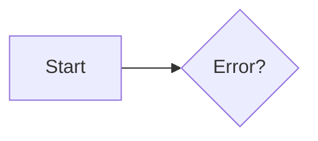
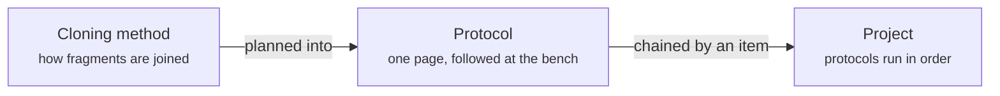
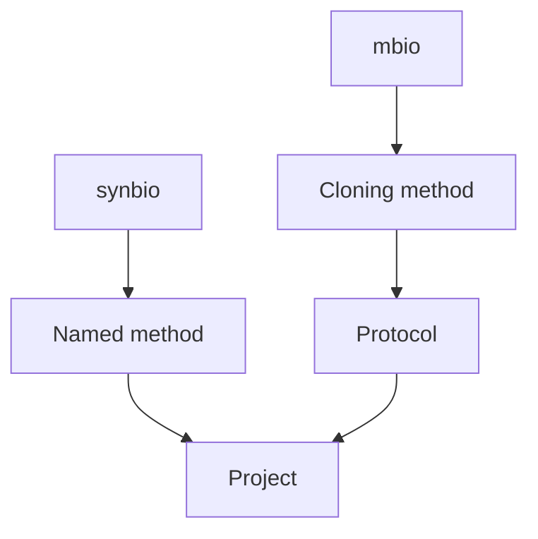
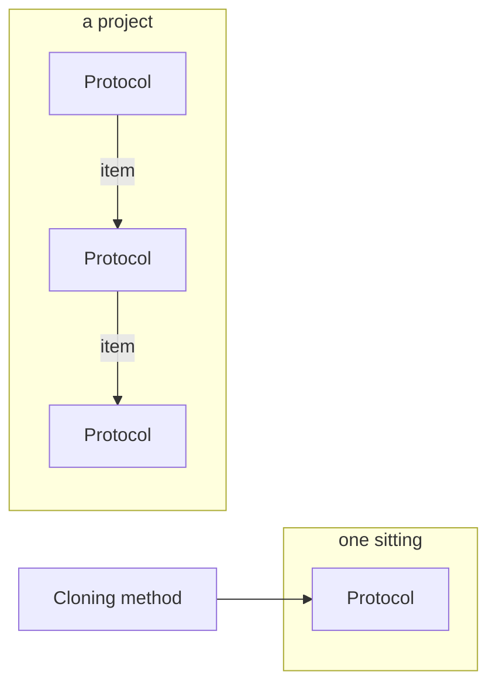

---
search:
  exclude: true
---

# What the docs site renders, and what makes the orientation schematic read well

Research note for issue #540, a sub-issue of map #539. Three questions: does the published site
render a ` ```mermaid ` fence, what does the theme already give without configuration, and what
shape should the method / protocol / project schematic take.

Everything measured here was measured on **2026-10-09** against this repo at `58bbbb1`, with
`zensical==0.0.57` and the `docs` pixi environment, in Chrome on macOS at a 1436 px viewport.
Where a claim is read off source rather than measured in a browser, the file and line say so.

## 1. The verdict, first

| Question | Answer |
| --- | --- |
| Does a mermaid fence render today? | **No.** It renders as a grey code block. `--strict` is silent |
| Will it render with config? | **Yes**, with three lines of YAML. No plugin, no dependency |
| What is the config? | one `custom_fences` entry on the `pymdownx.superfences` already enabled |
| What does it cost? | one network fetch per reader, from `unpkg.com`. Nothing at build time |
| Do grid cards work today? | **Yes**, with no config at all. The theme CSS already styles them |
| Can a diagram reach theme colours? | **Yes, by doing nothing.** Reaching them from inside the mermaid source fails |
| Node ceiling in one row | **5** at the measured 688 px content column |

## 2. Does zensical 0.0.57 render a mermaid fence?

### Today: no, and silently

A scratch page carrying this fence was added and `pixi run docs-build` run unchanged:

````markdown

````

The build finished green. Its whole output:

```text
Build started
No issues found
Build finished in 6.33s
```

`docs-build` is `zensical build --clean --strict` (`pyproject.toml`, `[tool.pixi.feature.docs.tasks]`).
`--strict` said nothing. The generated HTML:

```html
<div class="highlight"><pre><span></span><code>graph LR
  A[Start] --&gt; B{Error?};
</code></pre></div>
```

That is a syntax-highlighted code block. A reader sees the mermaid source as text. **The build
cannot catch this** — it is a well-formed fenced code block, which is exactly what it rendered.

### Why: an explicit `markdown_extensions` replaces zensical's defaults wholesale

`zensical/config.py` carries `DEFAULT_MARKDOWN_EXTENSIONS`, a dict of 22 entries, and one of
them is the mermaid fence:

```python
"pymdownx.superfences": {
    "custom_fences": [{"name": "mermaid", "class": "mermaid"}]
},
```

That default is reached by `config.get("markdown_extensions", DEFAULT_MARKDOWN_EXTENSIONS)` —
`.get` with a fallback, not a merge. `mkdocs.yml` declares `markdown_extensions:`, so **every one
of those 22 defaults is discarded**, the mermaid fence among them.

This is not the silent-key-drop the ticket expected, and the distinction matters for the next
ticket: zensical did not ignore anything. It took our list and used it instead of its own. Two
further defaults we lose the same way and may want back are `pymdownx.emoji`, without which
`:material-dna:` renders as the literal text `:material-dna:` — measured, see §3 — and
`pymdownx.tabbed`.

### With config: yes, and the minimal form is three lines

Two variants were built and the HTML compared.

**Variant (a), the minimal form:**

```yaml
  - pymdownx.superfences:
      custom_fences:
        - name: mermaid
          class: mermaid
```

**Variant (b), the form mkdocs-material documents**, adding
`format: !!python/name:pymdownx.superfences.fence_code_format`.

Both built green under `--strict` and **both emitted byte-identical HTML**:

```html
<pre class="mermaid"><code>graph LR
  A[Start] --&gt; B{Error?};</code></pre>
```

So zensical does honour a `!!python/name:` YAML tag — but the tag buys nothing here, and
variant (a) is what to write. This is the narrower option the Restraint section asks for: three
lines, inside an extension already enabled, no new dependency, no new plugin, and the diff
reverts to nothing if the diagram is dropped.

### What then renders it, and what that costs

The theme JavaScript bundle shipped with zensical is mkdocs-material's, mermaid support
included. From `site/assets/javascripts/bundle.49251538.min.js`:

- it selects `pre.mermaid` — which is why the fence's `class:` has to be exactly `mermaid`;
- if `mermaid` is undefined it loads `https://unpkg.com/mermaid@11/dist/mermaid.min.js`;
- it calls `mermaid.initialize({startOnLoad:false, themeCSS: …, sequence:{…}})` — **no `theme`
  and no `themeVariables`**, only a `themeCSS` string;
- it renders into a `div.mermaid` with `attachShadow({mode:"closed"})` and replaces the `<pre>`.

Measured in the browser: `typeof mermaid === "object"`, `div.mermaid` count 2 for two fences,
`pre.mermaid` count 0, `shadowRoot` null (consistent with `mode:"closed"`). The mermaid version
that loaded was **11.17.2**, printed by mermaid itself in an error banner.

**The one cost.** Mermaid is fetched from `unpkg.com` at page view, not vendored. It is a new
third-party origin for the published site, though not its first: the page already fetches
`fonts.googleapis.com`. The build itself pays nothing — build time was 4.0 to 6.3 s across six
builds here, with and without diagrams, and the difference is noise. If the unvendored CDN is
unacceptable, the lever is `extra_javascript` pinning a local copy, which is a larger change
than the diagram is worth; that trade is for whoever lands it.

## 3. What the theme already gives, unconfigured

### Grid cards work, with no config

`attr_list` and `md_in_html` are both enabled in `mkdocs.yml`. The Material card-grid markup was
built unchanged and rendered to Material's expected structure:

```html
<div class="grid cards">
<ul>
<li><p><strong>Card one</strong></p><hr /><p>Body text for card one.</p>…</li>
```

The theme CSS carries the selectors: 38 occurrences of `.md-typeset .grid` in
`main.5da3a30f.min.css`. Measured on screen, the two cards render as bordered boxes side by
side in the content column, with the `---` rule as a header separator. **Nothing needs adding.**

One gap to know about: `:material-dna:` inside a card rendered as the literal string
`:material-dna:`, because `pymdownx.emoji` is one of the 22 defaults our explicit list discards
(§2). A card grid that wants an icon per card needs that extension back — a second config line,
and it brings `materialx` emoji indexes with it. A card grid without icons needs nothing.

### Where a card grid beats the table the home page uses

A table and a card grid are not interchangeable, and the difference is what the cell holds:

| Use a table when | Use a card grid when |
| --- | --- |
| cells are short and comparable down a column | each entry is a short paragraph plus a link |
| the reader scans one column to pick a row | the reader scans for the one that is theirs and leaves |
| there are more than about six rows | there are two to six entries |
| columns mean something — the header names it | there is no second dimension to compare on |

The home page's job on this map is to orient and then hand off, and the entries it hands off to
are the two commands and the method pages — two to six destinations, each wanting a sentence and
a link, with no column anyone compares across. That is the card-grid case, and the survey in
`bench-facing-documentation.md` agrees from the other side: every tool that works for our reader
puts a short, scannable set of destinations in front of the detail, and none of them tabulates it.

A table stays the right answer where this repo already uses one to compare values — the enzyme
and threshold tables, and the method-comparison table on `methods/index.md`, which has real
columns.

## 4. Colour, light mode and dark mode

Three separate findings, two of them good news and one a flat no.

### You cannot reach theme colours from inside the mermaid source

Measured. This diagram was built and loaded:

```text
classDef themed fill:var(--md-primary-fg-color),stroke:var(--md-accent-fg-color)
```

It **failed to render**. It stayed a `pre.mermaid`, and mermaid printed *"Syntax error in text,
mermaid version 11.17.2"* at the foot of the page. Mermaid's `classDef` value grammar does not
accept a `var(...)` call. Every other diagram on the same page rendered, so this is the
directive, not the setup.

### You do not need to, because the theme already does it

Material's injected `themeCSS` paints every mermaid shape from a `--md-mermaid-*` custom
property — 26 of them, counted in `main.5da3a30f.min.css`. Each is an alias of an ordinary
palette variable:

```css
--md-mermaid-node-bg-color:var(--md-accent-fg-color--transparent)
--md-mermaid-node-fg-color:var(--md-accent-fg-color)
--md-mermaid-edge-color:var(--md-code-fg-color)
--md-mermaid-label-bg-color:var(--md-default-bg-color)
--md-mermaid-label-fg-color:var(--md-code-fg-color)
```

So an uncoloured diagram is already on-palette. Measured on `div.mermaid`:
`--md-mermaid-node-bg-color` resolved to `#526cfe1a` and `--md-mermaid-edge-color` to `#36464e`,
matching the site's accent and code colours.

**The rule this gives the diagram tickets: write no colour into the mermaid source at all.** It
is also the uncustomized answer Restraint asks for. A `style`/`classDef` with a literal hex would
parse, but it would pin one colour against a palette that moves — and it would not survive
anyway. Three upstream sources confirm it from the other side:

- mermaid's own theming page: *"The theming engine will only recognize hex colors and not color
  names"*, so `#ff0000` works and `red` does not. A `var()` call is neither.
- mkdocs-material issue #7034 is exactly this request, closed as out of scope: *"Allowing the
  author to override colors would also not work with light/dark mode, since most colors don't
  work well in both modes."* Material's CSS wins over an author's class on purpose.
- The documented route for a bespoke colour is `extra_css` redefining `--md-mermaid-*`, where
  `var()` is legal because it is real CSS. Never inside the mermaid source.

A `%%{init: {'themeVariables': …}}%%` directive does out-rank `mermaid.initialize()` in mermaid's
own precedence order, so it is the one thing that could win — but it also takes hex only, and hex
cannot follow a palette. Dagster pins its palette that way and, as a direct consequence, its
diagrams do not track light and dark.

One stale claim to ignore: the mkdocs-mermaid2 plugin's docs say a diagram *"will not switch out
of the box from light to dark"* and prescribe a JS re-render hook. **That describes mermaid2, not
Material's native integration**, which is what zensical ships. The hook solves a problem this
site does not have.

### Dark mode follows automatically — but the site has no dark mode today

Because the colours are custom properties resolved at paint, and custom properties inherit
through a shadow boundary, a palette switch restyles an **already-rendered** diagram with no
re-render. Measured: with the slate palette stylesheet loaded and
`data-md-color-scheme="slate"` set, `--md-mermaid-edge-color` moved from `#36464e` to
`hsla(225deg, 20%, 80%, 1)` and `--md-mermaid-label-bg-color` from `#fff` to
`hsla(225deg, 15%, 5%, 1)`, while the `div.mermaid` count stayed at 2 — the SVG was never rebuilt.

**But**: the published page loads exactly two stylesheets, `main.5da3a30f.min.css` and a Google
Fonts URL. `palette.*.min.css` is **not** among them, because `mkdocs.yml`'s `theme:` block is
`name: material` and nothing else — no `palette:` key, so no scheme toggle. Setting
`data-md-color-scheme="slate"` on the live page changed nothing until the palette stylesheet was
injected by hand.

So the honest answer to "in both light and dark mode" is: **the site is light-only today**, and
a diagram that writes no colour will follow a dark scheme correctly on the day one is added, at
no diagram-side cost. Adding the palette toggle is a separate change and not this map's.

## 5. What makes this particular diagram good

### Node count: five in one row, at a 688 px column

The content column measured **688 px** at a 1436 px viewport. A mermaid SVG scales to fit it, so
node count buys itself out of the type size. Four `graph LR` chains of plain one-word nodes were
built and the rendered height measured:

| Nodes | Rendered height | Scale vs. 3 nodes | Implied label size |
| --- | --- | --- | --- |
| 3 | 74 px | 1.00 | 16 px |
| 5 | 69 px | 0.93 | ~15 px |
| 7 | 50 px | 0.68 | ~11 px |
| 9 | 40 px | 0.54 | ~9 px |

Body text on the same page measured **14 px**. Mermaid's default flowchart label is 16 px, so the
diagram's type falls under the prose it sits in somewhere between 5 and 7 nodes. **Five is the
ceiling for a single left-to-right row**, and that is with one-word labels; the three candidates
below carry descriptive labels, which spend the budget faster.

This is a measurement of this site at this width, not a general law. Wrapping onto two rows, or
`TD`, buys nodes back by spending vertical space instead — candidate B below is 6 nodes in `TD`
and renders 386 px tall against candidate A's 64 px.

### Direction: LR for the chain, TD only if the two commands are in it

Measured heights for the three candidates: **A 64 px, B 386 px, C 594 px.** The subject is a
sequence — a method is planned into a protocol, protocols chain into a project — and a sequence
reads left to right in one band that does not push the prose below the fold. `LR` unless the
diagram has to show the two commands branching, which is a tree and wants `TD`.

### The words have to be the glossary's, and the brief's are not

`CONTEXT.md` contradicts the brief in three places, and the diagram has to follow the glossary:

- There is no entry for **method**. The entry is **cloning method** — "how an experiment joins
  its fragments into one plasmid". And the **protocol** entry lists *method* under `_Avoid_`, so a
  node labelled bare "method" is the one word the glossary says not to use next to "protocol".
- **Project** is "protocols run in order, each handed what the ones before it produced" — not
  "many sittings". `_Avoid_` lists *workflow*, *pipeline* and *campaign*.
- The thing chaining two protocols has a name: **item**, "one thing passed from a protocol to the
  one after it". The arrow in the diagram is an item, and labelling it is free.

A fourth glossary noun, **choice**, is deliberately left out of all three candidates: it is a
project's internal structure, not one of the three words a newcomer has to hold apart.

### What the comparable tools do

`bench-facing-documentation.md` surveyed five tools for page shape, not for diagrams. Read for
diagrams on 2026-10-09, **four of those five carry no concept schematic at all** — pydna's home
page does not even name `Dseq` or `Assembly`; Biopython's index is a table of contents whose
only image is the logo; Benchling's docs index has no figures; and SnapGene's Help Center has no
overview page to put one on (3 categories, 47 User Guide sections, none titled Overview,
Concepts or How it works).

**This corrects the brief.** Addgene's Gibson page does carry three diagrams, but they are
*molecule-state* schematics — T5 exonuclease chewing back both ends, where the four primers sit,
what the linearised fragments look like — around 6 to 8 labelled elements each, no captions.
They draw the DNA at each step, not how a vocabulary's nouns relate. **No tool in the bench-facing
set has the kind of diagram this ticket is asking for**, so the precedent has to come from
developer docs instead.

Counted from the mermaid source in each project's docs repo on 2026-10-09:

| Project | Page | Declaration | Nodes |
| --- | --- | --- | --- |
| Dagster | `getting-started/concepts`, the overview | `graph TD` | 14 |
| Dagster | the same page, 18 per-concept diagrams | `graph LR` | median 4, range 2–12 |
| mkdocs-material | `reference/diagrams` example | `graph LR` | 5 |
| Prefect | `concepts/work-pools` | `flowchart LR` | 5 |
| Prefect | `concepts/tasks`, `flows`, `states` | `flowchart TD` | 6 to 8 |
| nf-core | `about/governance` | `flowchart BT` | 7 |
| Nextflow | `developer/diagram` | `flowchart TB` | 31 |
| pydantic-ai | graph docs | `stateDiagram-v2` | 4, 5, 8 |

dbt and Snakemake ship **zero** mermaid blocks in their docs repos.

Three things fall out, and all three agree with the measurement above.

- **Count.** Small concept diagrams cluster at 2 to 8 nodes, median about 5 — the same number
  the pixel measurement gave independently.
- **Direction is semantic, not stylistic.** 20 of 21 relational diagrams in the sample are `LR`;
  every `TD`/`TB` one is a lifecycle, a state machine or a containment map. `LR` when the edge
  means "relates to", `TD` when it means "then". Ours means "relates to".
- **Growth is by splitting, not by adding nodes.** Dagster is the closest case — a concepts page
  whose whole job is relating nouns — and it runs one 14-node overview plus eighteen small
  per-noun diagrams. The only diagram in the sample over 14 nodes, Nextflow's 31-node
  architecture map, gets a page to itself rather than sitting on an orientation page.

**No authoritative published guidance on node counts exists.** Dagster's own docs style guide
covers mermaid and gives a palette but is silent on size, count and direction; Nextflow's diagram
page explains its notation and nothing else; mermaid's flowchart page offers only "not too much
and not too little". Two informal sources suggest 5 to 15 nodes, and a second frames the limit as
*width* — three or four parallel paths, on the grounds that docs columns are often 600 to 800 px.
Neither is authoritative, but the width framing matches the 688 px measured here exactly.

### Three candidates

**A — the chain.** Three nodes, `LR`, labelled edges, 64 px tall. Says the whole relation and
nothing else.



**B — the two commands across it.** Six nodes, `TD`, 386 px tall. Earns its height only if the
home page has to answer "which command do I type", which is `two-packages.md`'s job today.



**C — a project unrolled.** Shows that a project *is* protocols, chained by items, rather than
asserting it. Renders 594 px tall, the cost of the two subgraphs; it is the most informative and
the least scannable.



**The recommendation is A.** It is three nodes against a measured ceiling of five, it fits in one
band above the fold, it carries the glossary's words including *item* on the edge, it writes no
colour, and it is the only one of the three that a reader takes in without reading it. B's
content belongs on `two-packages.md`, which already exists in the nav. C is a good figure for
`projects/index.md` and a bad one for the home page.

## 6. What this costs, totalled

For whoever lands the change:

| Item | Cost |
| --- | --- |
| Config | 3 lines of YAML under an extension already enabled |
| Dependency | none |
| Plugin | none |
| Build time | none measurable |
| Reader | one `unpkg.com` fetch of `mermaid@11` per page carrying a diagram |
| Gate | untouched. `docs-build` is its own CI job and is already green with the fence |
| Reversibility | delete the three lines; the fence degrades back to a code block |

The one thing the config cannot do is fail loudly. If the three lines are ever deleted, every
mermaid diagram in the site silently becomes a code block and `--strict` stays green (§2). A
conformance rule asserting the custom fence is present whenever a ` ```mermaid ` fence exists in
`docs/` would catch it, and is the narrow version of that gate — but by Restraint it should wait
until there is more than one diagram to protect.

## 7. Open gaps

- **Benchling's docs were read as a markdown conversion**, not a browser render, so a figure
  present on the live page could have been stripped before it was counted.
- **That custom properties inherit through a shadow boundary is inferred, not cited.** CSS
  Variables Level 1 gives `Inherited: yes`; neither it nor MDN states the shadow-boundary case
  outright. It was measured here — the diagram repainted on a scheme change — and Material's
  whole integration depends on it, but no spec sentence was found that says it.
- **One viewport.** Every pixel measurement is at 1436 px wide, 688 px content column. The
  mobile column is narrower and the 5-node ceiling will be lower there; not measured.
- **The dark-mode measurement is synthetic.** The slate palette stylesheet was injected by hand
  because the site does not ship one. A real palette toggle may behave differently, though the
  mechanism measured — custom properties resolving at paint through the shadow boundary — does
  not depend on how the attribute gets set.
- **Only `flowchart`/`graph` was exercised.** Sequence, class and state diagrams carry their own
  `--md-mermaid-sequence-*` variables in the bundle but were not rendered. Material styles those
  five types and no others: pie, gantt, user journey, git graph and requirement diagrams render
  unstyled and are documented as unsupported. A flowchart is inside the supported set.
- **`pymdownx.emoji` and `pymdownx.tabbed` are discarded by the same mechanism** as the mermaid
  fence and were not otherwise investigated. Whether either is wanted is somebody's ticket, not
  this one's.
